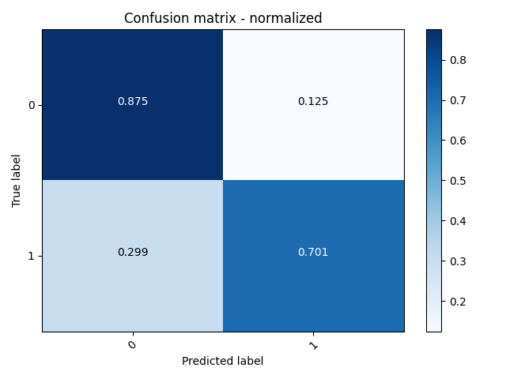
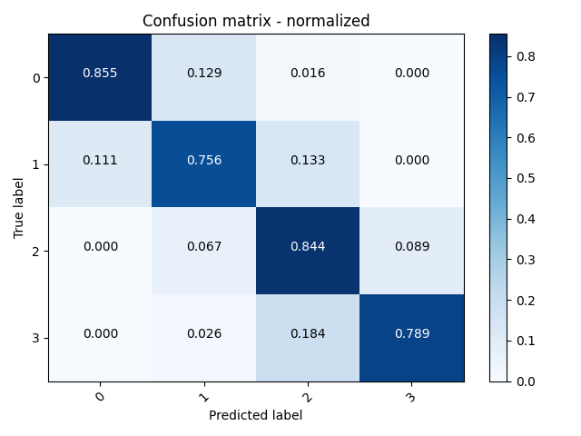
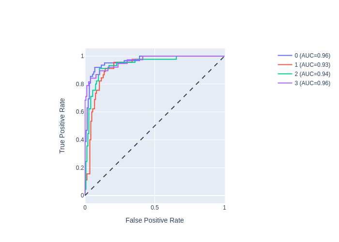

# ShapeAXI

Welcome to the official documentation for **ShapeAXI**. Dive into the cutting-edge framework designed for comprehensive shape analysis.  

---

## Table of Contents
- [Introduction](#introduction)
- [Installation](#installation)
- [Usage](#usage)
- [How does it work](#how-does-it-work)
- [Experiments & Results](#experiments--results)
- [Explainability](#explainability)
- [Contribute](#contribute)
- [Application](#application)
- [FAQs](#faqs)
- [License](#license)

---

## Introduction

**ShapeAXI** is a state-of-the-art shape analysis framework that harnesses a multi-view approach. This approach is adept at capturing 3D objects from a variety of viewpoints and analyzing them through 2D Convolutional Neural Networks (CNNs).

---

## Installation

(python 3.8 or 3.9 are required, no other versions)

### Installation of shapeaxi
```bash
pip install shapeaxi
```

### Installation of pytorch3d 

For this installation, we are going to use a variable, **{YOURVERSION}**, because this installation is specific to each computer configuration.
First, you can run this line to print the content of the variable **{YOURVERSION}** that we will use :
```bash
python -c "import sys; import torch; pyt_version_str=torch.__version__.split('+')[0].replace('.', ''); version_str=''.join([f'py3{sys.version_info.minor}_cu', torch.version.cuda.replace('.', ''), f'_pyt{pyt_version_str}']); print(version_str)"
```
It will print something like this : **py39_cu117_pyt201**.  
- Finally, you can run this line by adding your editing **{YOURVERSION}**, 
```bash
pip install --no-index --no-cache-dir pytorch3d -f https://dl.fbaipublicfiles.com/pytorch3d/packaging/wheels/{YOURVERSION}/download.html
```

Finally, check the installation,
```bash
pip show pytorch3d
```
---

## Usage

In this package you have the possibility of running four different models :
- **Classification**
- **Regression**
- **Segmentation**
- **IcoConv**

### Running ShapeAXI

To use ShapeAXI, execute the `saxi_folds.py` script with several options:

```bash
usage: shapeaxi [-h] [--csv CSV] [--csv_train CSV_TRAIN] [--csv_test CSV_TEST] [--folds FOLDS] [--valid_split VALID_SPLIT] [--group_by GROUP_BY] --nn
                {SaxiClassification,SaxiRegression,SaxiSegmentation,SaxiIcoClassification,SaxiIcoClassification_fs,SaxiRing,SaxiRingTeeth} [--model MODEL] [--train_sphere_samples TRAIN_SPHERE_SAMPLES]
                [--surf_column SURF_COLUMN] [--class_column CLASS_COLUMN] [--scale_factor SCALE_FACTOR] [--column_scale_factor COLUMN_SCALE_FACTOR] [--profiler PROFILER]
                [--compute_scale_factor COMPUTE_SCALE_FACTOR] [--compute_features COMPUTE_FEATURES] [--mount_point MOUNT_POINT] [--num_workers NUM_WORKERS] [--base_encoder BASE_ENCODER]
                [--base_encoder_params BASE_ENCODER_PARAMS] [--hidden_dim HIDDEN_DIM] [--radius RADIUS] [--image_size IMAGE_SIZE] [--lr LR] [--epochs EPOCHS] [--batch_size BATCH_SIZE]
                [--patience PATIENCE] [--log_every_n_steps LOG_EVERY_N_STEPS] [--tb_dir TB_DIR] [--tb_name TB_NAME] [--neptune_project NEPTUNE_PROJECT] [--neptune_tags NEPTUNE_TAGS]
                [--path_ico_right PATH_ICO_RIGHT] [--path_ico_left PATH_ICO_LEFT] [--layer LAYER] [--fs_path FS_PATH] [--num_images NUM_IMAGES] [--ico_lvl ICO_LVL]
                [--crown_segmentation CROWN_SEGMENTATION] [--fdi FDI] [--csv_true_column CSV_TRUE_COLUMN] [--csv_tag_column CSV_TAG_COLUMN] [--csv_prediction_column CSV_PREDICTION_COLUMN]
                [--eval_metric {F1,AUC}] [--target_layer TARGET_LAYER] [--fps FPS] [--out OUT]

Automatically train and evaluate a N fold cross-validation model for Shape Analysis Explainability and Interpretability

optional arguments:
  -h, --help            show this help message and exit

Split:
  --csv CSV             CSV with columns surf,class
  --csv_train CSV_TRAIN
                        CSV with column surf
  --csv_test CSV_TEST   CSV with column surf
  --folds FOLDS         Number of folds
  --valid_split VALID_SPLIT
                        Split float [0-1]
  --group_by GROUP_BY   GroupBy criteria in the CSV. For example, SubjectID in case the same subjects has multiple timepoints/data points and the subject must belong to the same data split

Train:
  --nn {SaxiClassification,SaxiRegression,SaxiSegmentation,SaxiIcoClassification,SaxiIcoClassification_fs,SaxiRing,SaxiRingTeeth}
                        Neural network name : SaxiClassification, SaxiRegression, SaxiSegmentation, SaxiIcoClassification, SaxiIcoClassification_fs, SaxiRing, SaxiRingTeeth
  --model MODEL         Model to continue training
  --train_sphere_samples TRAIN_SPHERE_SAMPLES
                        Number of samples for the training sphere
  --surf_column SURF_COLUMN
                        Surface column name
  --class_column CLASS_COLUMN
                        Class column name
  --scale_factor SCALE_FACTOR
                        Scale factor for the shapes
  --column_scale_factor COLUMN_SCALE_FACTOR
                        Specify the name if there already is a column with scale factor in the input file
  --profiler PROFILER   Profiler
  --compute_scale_factor COMPUTE_SCALE_FACTOR
                        Compute a global scale factor for all shapes in the population.
  --compute_features COMPUTE_FEATURES
                        Compute features for the shapes in the population.
  --mount_point MOUNT_POINT
                        Dataset mount directory
  --num_workers NUM_WORKERS
                        Number of workers for loading
  --base_encoder BASE_ENCODER
                        Base encoder for the feature extraction
  --base_encoder_params BASE_ENCODER_PARAMS
                        Base encoder parameters that are passed to build the feature extraction
  --hidden_dim HIDDEN_DIM
                        Hidden dimension for features output. Should match with output of base_encoder. Default value is 512
  --radius RADIUS       Radius of icosphere
  --image_size IMAGE_SIZE
                        Image resolution size
  --lr LR               Learning rate
  --epochs EPOCHS       Max number of epochs
  --batch_size BATCH_SIZE
                        Batch size
  --patience PATIENCE   Patience for early stopping
  --log_every_n_steps LOG_EVERY_N_STEPS
                        Log every n steps
  --tb_dir TB_DIR       Tensorboard output dir
  --tb_name TB_NAME     Tensorboard experiment name
  --neptune_project NEPTUNE_PROJECT
                        Neptune project
  --neptune_tags NEPTUNE_TAGS
                        Neptune tags
  --path_ico_right PATH_ICO_RIGHT
                        Path to ico right (default: ../3DObject/sphere_f327680_v163842.vtk)
  --path_ico_left PATH_ICO_LEFT
                        Path to ico left (default: ../3DObject/sphere_f327680_v163842.vtk)
  --layer LAYER         Layer, choose between 'Att','IcoConv2D','IcoConv1D','IcoLinear' (default: IcoConv2D)
  --fs_path FS_PATH     Path to freesurfer folder
  --num_images NUM_IMAGES
                        Number of images to use for the training
  --ico_lvl ICO_LVL     Ico level, minimum level is 1 (default: 2)

Prediction group:
  --crown_segmentation CROWN_SEGMENTATION
                        Isolation of each different tooth in a specific vtk file
  --fdi FDI             numbering system. 0: universal numbering; 1: FDI world dental Federation notation

Test group:
  --csv_true_column CSV_TRUE_COLUMN
                        Which column to do the stats on
  --csv_tag_column CSV_TAG_COLUMN
                        Which column has the actual names
  --csv_prediction_column CSV_PREDICTION_COLUMN
                        csv true class
  --eval_metric {F1,AUC}
                        Score you want to choose for picking the best model : F1 or AUC

Explainability group:
  --target_layer TARGET_LAYER
                        Target layer for explainability
  --fps FPS             Frames per second

Output:
  --out OUT             Output
```  

---

## How does it work

### 1. Compute scale factor

The first step of the code is to compute a global scale factor for all shapes in the population.  
If you want to do this, add ```--compute_scale_factor 1```.  
Moreover, if you already has a column with **scale_factor** in your csv file, specify it with ```--column_scale_factor name_of_your_column```.
Otherwise, if you do not want to compute a global scale factor, do not specify anything and it will skip this part.  


### 2. Split

No matter which model you choose you must specify your input.  
You can choose between ```--csv``` input or both ```--csv_first_train``` and ```--csv_first_test```. If you specify one csv file as input, ShapeAXI will split the dataset between train and test (80% and 20% but you can specify the split using ```--valid_split``` if you want 85% and 15% for example).  
Otherwise, if you specify csv_train and csv_test, it will skip this first split.    
Now, ShapeAXI uses the train set and split it between : train, test and valid dataset for each folder.  
ShapeAXI will train, test and evaluate one model for each folder.
Here, an example of the content of you csv files : 

| surf                                 | class  |
|--------------------------------------|--------|
| path/to/shape1.vtk                   | class1 |
| path/to/shape2.stl                   | class2 |
| path/to/shape3.vtk                   | class1 |
| ...                                  | ...    |

**surf**: This column holds the file paths to the 3D shape objects. The tool supports the formats `.vtk` and `.stl`.  
**class**: This column indicates the class of the 3D object.

### 3. Training 

For this step, there are one training, validation and testing dataset for each fold. You can choose for the training : batch size, maximum number of epochs, model you want.  
If you want, you can specify ```--csv_train```, ```--csv_test``` and ```--csv_valid``` for each fold.

### 4. Test, evaluation, aggregate and explainability

Finally, ShapeAXI will test the different models after their training. It will test them during the evaluation part.  
During this process, ShapeAXI will pick the best model from all the different folders depending on F1 score or AUC score.  
You can choose the evaluation metric with the option ```--eval_metric F1``` or ```--eval_metric AUC```.  
Your best model will then be tested on the first test dataset of the first split.
ShapeAXI will produce : 
- A confusion matrix.
- ROC curves.
- Explainability maps for each shape in the dataset.


### Examples

#### Classification (--nn SaxiClassification)

```bash
shapeaxi --csv your_data.csv --nn SaxiClassification --epochs 40 --folds 5 --mount_point /path/to/your/data/directory --out /path/to/your/output_directory --compute_scale_factor 1 --surf_column surf --class_column class --batch_size 8
```

#### IcoConv (--nn SaxiIcoClassification)

For this model, you **have to** specify the path to your right vtk hemisphere data and same for the left one.

```bash
shapeaxi --csv your_data.csv --nn SaxiIcoClassification --epochs 30 --folds 3 --mount_point /path/to/your/data/directory --out /path/to/your/output_directory --path_ico_left /path/to/vtk/left/hemisphere --path_ico_right /path/to/vtk/right/hemisphere --class_column ASD_administered
```

#### Regression (--nn SaxiRegression)

```bash
shapeaxi --csv your_data.csv --nn SaxiClassification --epochs 40 --folds 5 --mount_point /path/to/your/data/directory --surf_column surf --class_column class --batch_size 8 --compute_scale_factor 1 --out /path/to/your/output_directory  
```

#### Segmentation (--nn SaxiSegmentation)

```bash
shapeaxi --csv your_data.csv --nn SaxiSegmentation --epochs 40 --folds 5 --mount_point /path/to/your/data/directory --out /path/to/your/output_directory --eval_metric AUC
```

#### Ring Neighbors for Brain Data (--nn SaxiRing)

This model creates two networks for each hemisphere of the brain and uses the output surfaces from Freesurfer. If you want to use this model with other data use the **next** model.

```bash
shapeaxi --csv your_data.csv --nn SaxiRing --epochs 40 --folds 5 --mount_point /path/to/your/data/directory --surf_column surf --class_column class --batch_size 8 --fs_path /path/to/directory/subjects --out /path/to/your/output_directory
```

#### Ring Neighbors for Teeth (or other) Data (--nn SaxiRingTeeth)

```bash
shapeaxi --csv your_data.csv --nn SaxiRingTeeth --epochs 40 --folds 5 --mount_point /path/to/your/data/directory --surf_column surf --class_column class --batch_size 8 --out /path/to/your/output_directory
```


## Experiments & Results

**ShapeAXI** has been rigorously tested across multiple domains. Below is a summary of our key experiments:

### Condyles Classification

- **Categories**: Healthy vs. Degenerative states
- **Accuracy**: ~79.78%




### Cleft Patients Severity Classification

- **Classes**: Severity levels 0 to 3
- **Accuracy**: ~81.58%



---

## Explainability

In **ShapeAXI**, we prioritize transparency and understanding. The explainability feature of our framework offers heat-maps which grant insights into its classification rationale.

https://github.com/DCBIA-OrthoLab/ShapeAXI/assets/7086191/120b0095-5f2d-4f0d-b650-a0587a33e067

https://github.com/DCBIA-OrthoLab/ShapeAXI/assets/7086191/2c635250-624f-4cce-b150-4d5507b398b4

---

## Contribute

We welcome community contributions to **ShapeAXI**. For those keen on enhancing this tool, please adhere to the steps below:

1. **Fork** the repository.
2. Create your **feature branch** (`git checkout -b feature/YourFeature`).
3. Commit your changes (`git commit -am 'Add some feature'`).
4. Push to the branch (`git push origin feature/YourFeature`).
5. Open a **pull request**.

For a comprehensive understanding of our contribution process, consult our [Contribution Guidelines](path/to/contribution_guidelines.md).

---

Of course! Here are some general FAQ entries tailored for a tool/framework like ShapeAXI:

---

## Application 

One of the application on this tool is to be able to run a prediction using a pretrained model on your own data.  
If you want, you can have access to this package documentation called **dentalmodelseg** :

[DentalModelSeg](DentalModelSeg.md)

## FAQs

### What is ShapeAXI?

**Answer:** ShapeAXI is an innovative shape analysis framework that employs a multi-view approach, rendering 3D objects from varied perspectives and analyzing them using 2D Convolutional Neural Networks (CNNs).

---

### How do I install and set up ShapeAXI?

**Answer:** Detailed installation and setup instructions can be found in the 'Installation' section of our documentation. Simply follow the steps mentioned, and you should have ShapeAXI up and running in no time.

---

### Can I use ShapeAXI for my own datasets?

**Answer:** Absolutely! ShapeAXI is designed to be versatile. You can use it on a wide variety of shape datasets. Ensure your data is in the required format as outlined in the 'Usage' section.

---

### How does ShapeAXI handle explainability?

**Answer:** ShapeAXI offers a unique approach to explainability, providing heat-maps for each class across every shape. These visualizations provide insights into the underlying object characteristics and the classification rationale.

---

### Are there any known limitations of ShapeAXI?

**Answer:** Like all models and frameworks, ShapeAXI has its constraints. It is optimized for the datasets and tasks it has been trained and tested on. While it offers versatility across a range of datasets, results may vary based on the quality and type of data. We continually work on refining and improving ShapeAXI to overcome any limitations.

---

### How can I contribute to ShapeAXI's development?

**Answer:** We welcome contributions! Please refer to the 'Contribute' section of our documentation for guidelines on how you can contribute.

---

### Who do I contact for technical support or questions about ShapeAXI?

**Answer:** For technical support or any questions, please create a new issue in our GitHub repository.

---

### Will there be future updates to ShapeAXI?

**Answer:** Yes, we plan on continuously improving and expanding ShapeAXI based on user feedback, new research, and technological advancements. Stay tuned to our repository for updates.

---

## License

**ShapeAXI** is under the [APACHE 2.0](LICENSE) license.

---

**ShapeAXI Team**: For further details, inquiries, or suggestions, feel free to [contact us](mailto:juan_prieto@med.unc.edu).
