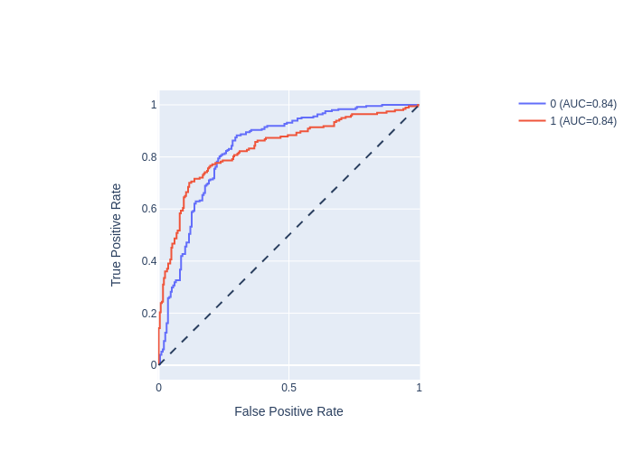

# ShapeAXI

Welcome to the official documentation for **ShapeAXI**. Dive into the cutting-edge framework designed for comprehensive shape analysis.  

---
If you want, you can have access to another documentation to run an executable called **dentalmodelseg** :


[DentalModelSeg](DentalModelSeg.md)
---

## Table of Contents
- [Introduction](#introduction)
- [Installation](#installation)
- [Usage](#usage)
- [Experiments & Results](#experiments--results)
- [Explainability](#explainability)
- [Contribute](#contribute)
- [FAQs](#faqs)
- [License](#license)

---

## Introduction

**ShapeAXI** is a state-of-the-art shape analysis framework that harnesses a multi-view approach. This approach is adept at capturing 3D objects from a variety of viewpoints and analyzing them through 2D Convolutional Neural Networks (CNNs).

---

## Installation (python 3.8 or 3.9 are required, no other versions)

### Installation of shapeaxi
```bash
pip install shapeaxi
```

### Installation of pytorch3d 

For this installation, we are going to use a variable, {YOURVERSION}, because this installation is specific to each computer configuration.
- First, you need to install ipython :
```bash
pip install ipython
```
Then, you can run **ipython** in the terminal (or **python -m IPython** if it is not working).  
You can now add paste these lines :
```bash
import sys
import torch
pyt_version_str=torch.__version__.split("+")[0].replace(".", "")
version_str="".join([
    f"py3{sys.version_info.minor}_cu",
    torch.version.cuda.replace(".",""),
    f"_pyt{pyt_version_str}"
])
print(version_str)
```
It will print something like this : **py39_cu117_pyt201**.  
This is the content of your variable {YOURVERSION}.
- Finally, exit of ipython and in your terminal you can run this line by adding your editing {YOURVERSION}, 
```bash
pip install --no-index --no-cache-dir pytorch3d -f https://dl.fbaipublicfiles.com/pytorch3d/packaging/wheels/{YOURVERSION}/download.html
```

Finally, check the installation,
```bash
pip show pytorch3d
```
---

## Usage

### Basic Usage:

To get started with **ShapeAXI**, follow the steps below:


#### Example CSV File

Your input CSV file should be structured as follows:

| surf                                 | class  |
|--------------------------------------|--------|
| path/to/shape1.vtk                   | class1 |
| path/to/shape2.stl                   | class2 |
| path/to/shape3.obj                   | class1 |
| ...                                  | ...    |


- **surf**: This column holds the file paths to the 3D shape objects. The tool supports the formats `.vtk`, `.stl`, and `.obj`.
- **class**: This column indicates the class of the 3D object.

### Running ShapeAXI

To use ShapeAXI, execute the `saxi_folds.py` script:

```bash
python saxi_folds.py --csv your_data.csv --compute_scale_factor 1 --surf_column surf --class_column class --subdivision_level 2 --batch_size 8 --out output_dir/
```

Ensure you replace `your_data.csv` with the correct path to your specific CSV file. 

```
usage: saxi_folds.py [-h] --csv CSV [--folds FOLDS] [--valid_split VALID_SPLIT] [--group_by GROUP_BY] [--nn NN] [--surf_column SURF_COLUMN] [--class_column CLASS_COLUMN] [--compute_scale_factor COMPUTE_SCALE_FACTOR] [--mount_point MOUNT_POINT]
                     [--num_workers NUM_WORKERS] [--base_encoder BASE_ENCODER] [--base_encoder_params BASE_ENCODER_PARAMS] [--hidden_dim HIDDEN_DIM] [--radius RADIUS] [--subdivision_level SUBDIVISION_LEVEL] [--image_size IMAGE_SIZE] [--lr LR] [--epochs EPOCHS]
                     [--batch_size BATCH_SIZE] [--patience PATIENCE] [--log_every_n_steps LOG_EVERY_N_STEPS] [--tb_dir TB_DIR] [--tb_name TB_NAME] [--neptune_project NEPTUNE_PROJECT] [--neptune_tags NEPTUNE_TAGS] [--target_layer TARGET_LAYER] [--fps FPS] [--out OUT]

Automatically train and evaluate a N fold cross-validation model for Shape Analysis Explainability and Interpretability

options:
  -h, --help            show this help message and exit

Split:
  --csv CSV             CSV with columns surf,class
  --folds FOLDS         Number of folds
  --valid_split VALID_SPLIT
                        Number of folds
  --group_by GROUP_BY   GroupBy criteria in the CSV. For example, SubjectID in case the same subjects has multiple timepoints/data points and the subject must belong to the same data split

Train:
  --nn NN               Type of neural network for training
  --surf_column SURF_COLUMN
                        Surface column name
  --class_column CLASS_COLUMN
                        Class column name
  --compute_scale_factor COMPUTE_SCALE_FACTOR
                        Compute a global scale factor for all shapes in the population.
  --mount_point MOUNT_POINT
                        Dataset mount directory
  --num_workers NUM_WORKERS
                        Number of workers for loading
  --base_encoder BASE_ENCODER
                        Base encoder for the feature extraction
  --base_encoder_params BASE_ENCODER_PARAMS
                        Base encoder parameters that are passed to build the feature extraction
  --hidden_dim HIDDEN_DIM
                        Hidden dimension for features output. Should match with output of base_encoder. Default value is 512
  --radius RADIUS       Radius of icosphere
  --subdivision_level SUBDIVISION_LEVEL
                        Subdivision level for icosahedron
  --image_size IMAGE_SIZE
                        Image resolution size
  --lr LR, --learning-rate LR
                        Learning rate
  --epochs EPOCHS       Max number of epochs
  --batch_size BATCH_SIZE
                        Batch size
  --patience PATIENCE   Patience for early stopping
  --log_every_n_steps LOG_EVERY_N_STEPS
                        Log every n steps
  --tb_dir TB_DIR       Tensorboard output dir
  --tb_name TB_NAME     Tensorboard experiment name
  --neptune_project NEPTUNE_PROJECT
                        Neptune project
  --neptune_tags NEPTUNE_TAGS
                        Neptune tags

Explainability group:
  --target_layer TARGET_LAYER
                        Target layer for explainability
  --fps FPS             Frames per second

Output:
  --out OUT             Output
```

#### Workflow:

1. On running `saxi_folds.py`, the tool will:
   - Generate the necessary N folds.
   - Handle the training, validation, and testing.

2. The tool then produces:
   - A confusion matrix.
   - ROC curves.
   - Explainability maps for each shape in the dataset.

## Experiments & Results

**ShapeAXI** has been rigorously tested across multiple domains. Below is a summary of our key experiments:

### Condyles Classification

- **Categories**: Healthy vs. Degenerative states
- **Accuracy**: ~79.78%




### Cleft Patients Severity Classification

- **Classes**: Severity levels 0 to 3
- **Accuracy**: ~81.58%


---

## Explainability

In **ShapeAXI**, we prioritize transparency and understanding. The explainability feature of our framework offers heat-maps which grant insights into its classification rationale.

https://github.com/DCBIA-OrthoLab/ShapeAXI/assets/7086191/120b0095-5f2d-4f0d-b650-a0587a33e067

https://github.com/DCBIA-OrthoLab/ShapeAXI/assets/7086191/2c635250-624f-4cce-b150-4d5507b398b4

---

## Contribute

We welcome community contributions to **ShapeAXI**. For those keen on enhancing this tool, please adhere to the steps below:

1. **Fork** the repository.
2. Create your **feature branch** (`git checkout -b feature/YourFeature`).
3. Commit your changes (`git commit -am 'Add some feature'`).
4. Push to the branch (`git push origin feature/YourFeature`).
5. Open a **pull request**.

For a comprehensive understanding of our contribution process, consult our [Contribution Guidelines](path/to/contribution_guidelines.md).

---

Of course! Here are some general FAQ entries tailored for a tool/framework like ShapeAXI:

## FAQs

### What is ShapeAXI?

**Answer:** ShapeAXI is an innovative shape analysis framework that employs a multi-view approach, rendering 3D objects from varied perspectives and analyzing them using 2D Convolutional Neural Networks (CNNs).

---

### How do I install and set up ShapeAXI?

**Answer:** Detailed installation and setup instructions can be found in the 'Installation' section of our documentation. Simply follow the steps mentioned, and you should have ShapeAXI up and running in no time.

---

### Can I use ShapeAXI for my own datasets?

**Answer:** Absolutely! ShapeAXI is designed to be versatile. You can use it on a wide variety of shape datasets. Ensure your data is in the required format as outlined in the 'Usage' section.

---

### How does ShapeAXI handle explainability?

**Answer:** ShapeAXI offers a unique approach to explainability, providing heat-maps for each class across every shape. These visualizations provide insights into the underlying object characteristics and the classification rationale.

---

### Are there any known limitations of ShapeAXI?

**Answer:** Like all models and frameworks, ShapeAXI has its constraints. It is optimized for the datasets and tasks it has been trained and tested on. While it offers versatility across a range of datasets, results may vary based on the quality and type of data. We continually work on refining and improving ShapeAXI to overcome any limitations.

---

### How can I contribute to ShapeAXI's development?

**Answer:** We welcome contributions! Please refer to the 'Contribute' section of our documentation for guidelines on how you can contribute.

---

### Who do I contact for technical support or questions about ShapeAXI?

**Answer:** For technical support or any questions, please create a new issue in our GitHub repository.

---

### Will there be future updates to ShapeAXI?

**Answer:** Yes, we plan on continuously improving and expanding ShapeAXI based on user feedback, new research, and technological advancements. Stay tuned to our repository for updates.

---

## License

**ShapeAXI** is under the [APACHE 2.0](LICENSE) license.

---

**ShapeAXI Team**: For further details, inquiries, or suggestions, feel free to [contact us](mailto:juan_prieto@med.unc.edu).
